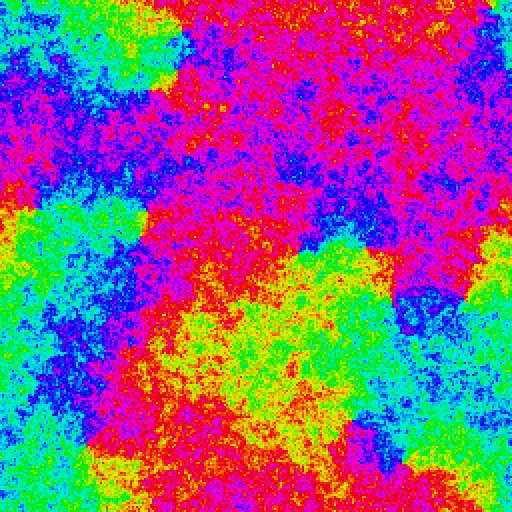
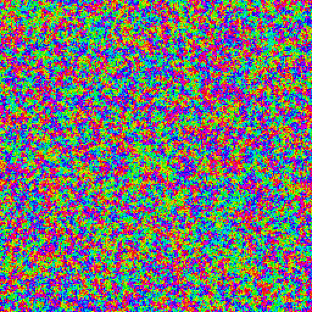

# simview

A window on a running tensor simulation: the sim computes on the GPU
through [tensor]'s slot dialect and [gpud]'s SDL backend, and the very
buffer the compute writes is what the fragment shader colormaps —
zero copies, one `SDL_GPUDevice` for both.

v1 shows the 2-D XY model live: hue is the spin angle; vortices are
the pinwheels where all colors meet. Below the BKT temperature (~0.89)
they annihilate and the field coarsens; above it they proliferate.

| T = 0.4, 200 steps | T = 1.5, 200 steps |
| --- | --- |
|  |  |

Measured: 100.9 fps mean over 606 frames at L = 256, over = 2,
windowed with vsync on a 120 Hz display (Apple M4 Pro). The number
moves with L, the overrelaxation count, the display's refresh rate,
and machine load. `SIMVIEW_AUTOQUIT_MS=6000 ./build/simview` reprints
it; `./build/simview --shot out.bmp [steps] [T]` renders offscreen
with no window at all.

The sim runs ~22 blocking dispatches per frame (gpud's SDL backend is
fully blocking in v1); the field buffer is never copied — the fragment
shader reads the same storage buffer the compute kernels write, on the
one shared `SDL_GPUDevice`.

## Controls

| key | action |
| --- | --- |
| Esc / close | quit |
| Space | pause |
| Up / Down | temperature ±0.05 (clamped to [0.05, 2.0]) |
| R | re-randomize the field |
| Right / Left | overrelaxation sweeps per frame ± |

## Build

Needs `g++-16` (tensor requires `-freflection`), `slangc`, SDL3
findable by CMake (a system package, or
`CMAKE_PREFIX_PATH=~/Projects/toolchains/sdl3`), and network on first
configure (FetchContent: tensor, which pins gpud).

```sh
make        # configure + build
make run
```

For local development against checked-out tensor/gpud:

```sh
TENSOR_SRC=~/Projects/tensor GPUD_SRC=~/Projects/gpud make
```

[tensor]: https://github.com/NivDeveloper/tensor-dev
[gpud]: https://github.com/NivDeveloper/gpud
